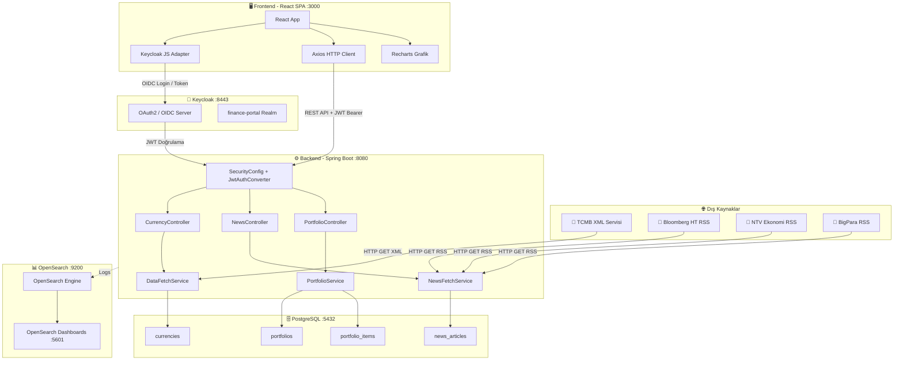
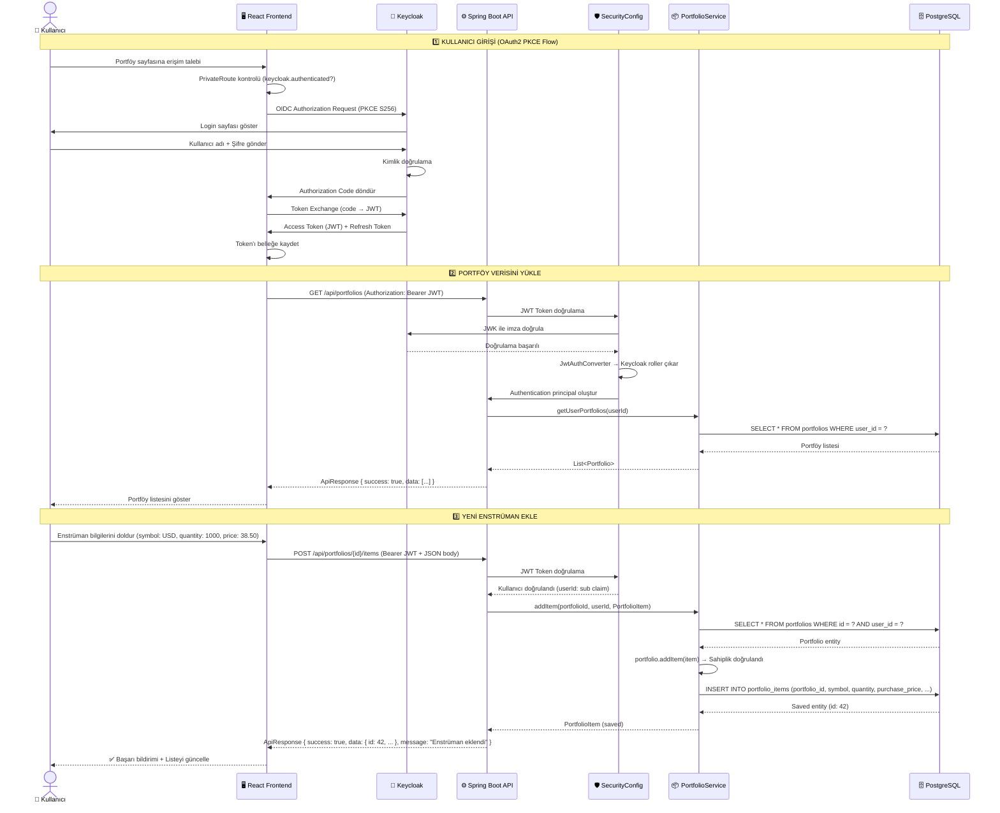
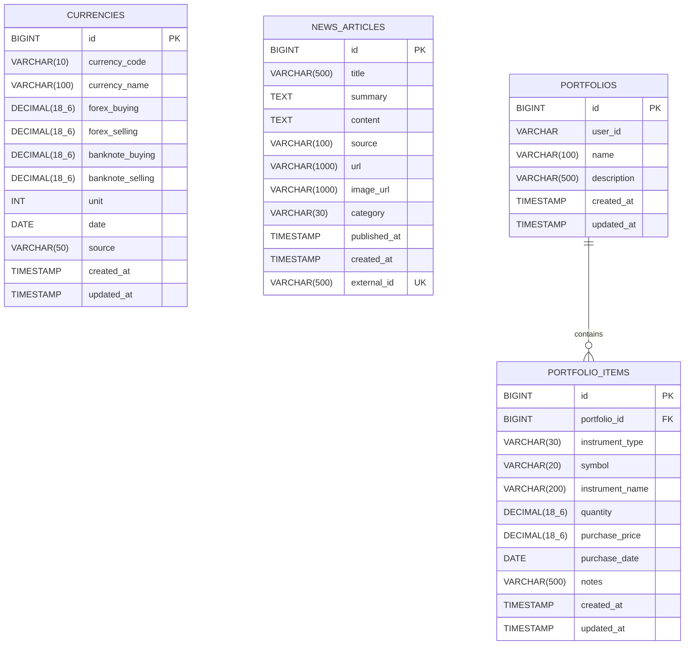

# 📄 Software Design Document (SDD)

**Proje:** Finans Portalı – Kurumsal Finansal Veri ve Portföy Yönetim Platformu  
**Versiyon:** 1.0  
**Son Güncelleme:** Mart 2026  
**Hazırlayan:** Finans Portalı Geliştirme Ekibi  

---

## İçindekiler

1. [Project Overview](#1-project-overview)
2. [System Architecture](#2-system-architecture)
3. [Visual Diagrams (Mermaid.js)](#3-visual-diagrams-mermaidjs)
4. [Database Schema](#4-database-schema)
5. [Security Architecture](#5-security-architecture)
6. [API Endpoints](#6-api-endpoints)
7. [Frontend Structure](#7-frontend-structure)
8. [Deployment & Future Improvements](#8-deployment--future-improvements)

---

## 1. Project Overview

### 1.1 Amaç

Finans Portalı, Toyota kurumsal standartlarına uygun olarak tasarlanmış, **gerçek zamanlı finansal veri izleme**, **haber takibi** ve **kişisel portföy yönetimi** yeteneklerini tek bir platformda sunan kurumsal düzeyde bir web uygulamasıdır.

### 1.2 Kapsam

| Alan | Açıklama |
|------|----------|
| **Döviz Kuru Takibi** | TCMB XML servisi üzerinden günlük döviz kurlarının otomatik çekilmesi, tarihsel veri depolama ve çizgi grafik analitiği |
| **Finans Haberleri** | RSS feed'lerden (Bloomberg HT, NTV Ekonomi, BigPara) otomatik haber toplama, kategorilendirme, arama ve filtreleme |
| **Portföy Yönetimi** | Kullanıcı bazlı çoklu portföy oluşturma, döviz/hisse/fon enstrüman ekleme, kâr/zarar hesaplama ve performans özeti |
| **Kimlik Doğrulama** | Keycloak OAuth2/OIDC tabanlı SSO, JWT token doğrulama, RBAC (Role-Based Access Control) |

### 1.3 Profesyonel Hedefler

- **Güvenilirlik:** Periyodik zamanlanmış görevler (scheduled tasks) ile veri sürekliliği ve güncelliği sağlanır.
- **Güvenlik:** Keycloak entegrasyonu ile kurumsal düzeyde kimlik yönetimi; hassas yapılandırma dosyaları (`application.yml`) versiyon kontrolünden çıkarılmıştır.
- **Ölçeklenebilirlik:** Docker Compose orchestration ile mikro servis mimarisine geçişe hazır modüler yapı.
- **Sürdürülebilirlik:** Katmanlı mimari (Controller → Service → Repository), standart DTO pattern, global exception handling ile bakım kolaylığı.

---

## 2. System Architecture

### 2.1 Mimari Bileşenler

Sistem dört ana bileşenden oluşur ve her biri Docker container olarak orkestre edilir:

| Bileşen | Teknoloji | Port | Açıklama |
|---------|-----------|------|----------|
| **Backend** | Spring Boot 3.x (Java 17+) | `8080` | RESTful API, iş mantığı, veri çekme servisleri |
| **Frontend** | React 18 + React Router | `3000` | SPA (Single Page Application), Recharts grafik, responsive UI |
| **Database** | PostgreSQL 15 Alpine | `5432` | İlişkisel veri depolama (currencies, news, portfolios) |
| **Auth Server** | Keycloak 24.0 | `8443` | OAuth2/OIDC SSO, JWT token üretimi, kullanıcı yönetimi |
| **Monitoring** | OpenSearch 2.12 + Dashboards | `9200`, `5601` | Log aggregation, performans izleme |

### 2.2 Backend Katmanlı Mimari

```
┌───────────────────────────────────────────────────────────────┐
│                      SPRING BOOT APPLICATION                  │
├───────────────────────────────────────────────────────────────┤
│  Controller Layer                                             │
│  ┌──────────────────┐ ┌────────────────┐ ┌─────────────────┐ │
│  │ CurrencyController│ │ NewsController │ │PortfolioController│
│  └────────┬─────────┘ └───────┬────────┘ └────────┬────────┘ │
│           │                   │                    │          │
│  Service Layer                                                │
│  ┌──────────────────┐ ┌────────────────┐ ┌─────────────────┐ │
│  │ DataFetchService │ │NewsFetchService│ │PortfolioService │ │
│  └────────┬─────────┘ └───────┬────────┘ └────────┬────────┘ │
│           │                   │                    │          │
│  Repository Layer (JPA)                                       │
│  ┌──────────────────┐ ┌──────────────────┐ ┌───────────────┐ │
│  │CurrencyRepository│ │NewsArticleRepo   │ │PortfolioRepo  │ │
│  └──────────────────┘ └──────────────────┘ └───────────────┘ │
├───────────────────────────────────────────────────────────────┤
│  Cross-Cutting Concerns                                       │
│  ┌────────────────┐ ┌──────────────────┐ ┌────────────────┐  │
│  │ SecurityConfig │ │JwtAuthConverter  │ │GlobalException │  │
│  │ (CORS, Auth)   │ │(Keycloak Roles)  │ │  Handler       │  │
│  └────────────────┘ └──────────────────┘ └────────────────┘  │
└───────────────────────────────────────────────────────────────┘
```

### 2.3 Veri Akış Kaynakları

| Kaynak | Format | Servis | Periyot |
|--------|--------|--------|---------|
| TCMB XML Servisi | XML | `DataFetchService` | Cron ile yapılandırılabilir (varsayılan ~15 dk) |
| Bloomberg HT RSS | RSS/XML | `NewsFetchService` | Cron ile yapılandırılabilir (varsayılan ~30 dk) |
| NTV Ekonomi RSS | RSS/XML | `NewsFetchService` | Cron ile yapılandırılabilir (varsayılan ~30 dk) |
| BigPara RSS | RSS/XML | `NewsFetchService` | Cron ile yapılandırılabilir (varsayılan ~30 dk) |

---

## 3. Visual Diagrams (Mermaid.js)

### 3.1 System Architecture Diagram

Aşağıdaki şema, sistemin tüm bileşenleri ve aralarındaki iletişim protokollerini göstermektedir:



### 3.2 Sequence Diagram – Kullanıcı Login & Portföye Enstrüman Ekleme

Aşağıdaki sequence diagram, bir kullanıcının sisteme giriş yapıp portföyüne yeni bir enstrüman ekleme sürecini adım adım göstermektedir:



---

## 4. Database Schema

### 4.1 Entity-Relationship Overview

Sistem dört ana tablo üzerine inşa edilmiştir. Tablolar arasındaki ilişkiler aşağıda detaylandırılmıştır:



### 4.2 Tablo Detayları

#### 4.2.1 `currencies` – Döviz Kurları

| Kolon | Tip | Constraint | Açıklama |
|-------|-----|-----------|----------|
| `id` | `BIGINT` | PK, AUTO_INCREMENT | Benzersiz kayıt ID |
| `currency_code` | `VARCHAR(10)` | NOT NULL, UNIQUE (code+date) | ISO 4217 döviz kodu (USD, EUR, GBP...) |
| `currency_name` | `VARCHAR(100)` | — | Döviz adı ("US DOLLAR", "EURO") |
| `forex_buying` | `DECIMAL(18,6)` | — | Döviz alış kuru |
| `forex_selling` | `DECIMAL(18,6)` | — | Döviz satış kuru |
| `banknote_buying` | `DECIMAL(18,6)` | — | Banknot alış kuru |
| `banknote_selling` | `DECIMAL(18,6)` | — | Banknot satış kuru |
| `unit` | `INT` | NOT NULL, DEFAULT 1 | Birim (1, 100 vb.) |
| `date` | `DATE` | NOT NULL | Kur tarihi |
| `source` | `VARCHAR(50)` | NOT NULL | Veri kaynağı ("TCMB") |
| `created_at` | `TIMESTAMP` | NOT NULL | Kayıt oluşturulma zamanı |
| `updated_at` | `TIMESTAMP` | — | Son güncelleme zamanı |

**İndeksler:**
- `uk_currency_code_date` → `UNIQUE(currency_code, date)` – Aynı tarih için tekrar kayıt oluşturmayı engeller
- `idx_currency_code` → `currency_code` – Kod bazlı sorgu performansı
- `idx_currency_date` → `date` – Tarih bazlı sorgu performansı

#### 4.2.2 `news_articles` – Haber Makaleleri

| Kolon | Tip | Constraint | Açıklama |
|-------|-----|-----------|----------|
| `id` | `BIGINT` | PK, AUTO_INCREMENT | Benzersiz haber ID |
| `title` | `VARCHAR(500)` | NOT NULL | Haber başlığı |
| `summary` | `TEXT` | — | İçerik özeti |
| `content` | `TEXT` | — | Tam içerik (opsiyonel) |
| `source` | `VARCHAR(100)` | — | Kaynak ("Bloomberg HT", "NTV") |
| `url` | `VARCHAR(1000)` | — | Kaynak URL |
| `image_url` | `VARCHAR(1000)` | — | Görsel URL |
| `category` | `VARCHAR(30)` | NOT NULL, ENUM | Haber kategorisi |
| `published_at` | `TIMESTAMP` | — | Yayınlanma tarihi |
| `created_at` | `TIMESTAMP` | NOT NULL | Sistem kayıt zamanı |
| `external_id` | `VARCHAR(500)` | UNIQUE | Duplicate kontrolü için benzersiz tanımlayıcı |

**Kategori Enum Değerleri:** `GENEL_EKONOMI`, `HISSE`, `DOVIZ`, `TAHVIL_BONO`, `FON`, `KRIPTO`, `EMTIA`, `DUNYA`, `DIGER`

**İndeksler:**
- `idx_news_category` → `category`
- `idx_news_published_at` → `published_at`
- `idx_news_source` → `source`

#### 4.2.3 `portfolios` – Kullanıcı Portföyleri

| Kolon | Tip | Constraint | Açıklama |
|-------|-----|-----------|----------|
| `id` | `BIGINT` | PK, AUTO_INCREMENT | Portföy ID |
| `user_id` | `VARCHAR` | NOT NULL | Keycloak kullanıcı ID (sub claim) |
| `name` | `VARCHAR(100)` | NOT NULL | Portföy adı |
| `description` | `VARCHAR(500)` | — | Açıklama |
| `created_at` | `TIMESTAMP` | NOT NULL | Oluşturulma zamanı |
| `updated_at` | `TIMESTAMP` | — | Son güncelleme |

**İndeksler:**
- `idx_portfolio_user_id` → `user_id` – Kullanıcı bazlı hızlı erişim

#### 4.2.4 `portfolio_items` – Portföy Kalemleri

| Kolon | Tip | Constraint | Açıklama |
|-------|-----|-----------|----------|
| `id` | `BIGINT` | PK, AUTO_INCREMENT | Kalem ID |
| `portfolio_id` | `BIGINT` | FK → portfolios(id), NOT NULL | Ait olduğu portföy |
| `instrument_type` | `VARCHAR(30)` | NOT NULL | Enstrüman tipi (HISSE, DOVIZ, FON, TAHVIL, KRIPTO) |
| `symbol` | `VARCHAR(20)` | NOT NULL | Sembol (USD, THYAO vb.) |
| `instrument_name` | `VARCHAR(200)` | — | Enstrüman adı |
| `quantity` | `DECIMAL(18,6)` | NOT NULL, POSITIVE | Miktar |
| `purchase_price` | `DECIMAL(18,6)` | NOT NULL, POSITIVE | Alış fiyatı (birim) |
| `purchase_date` | `DATE` | — | Alış tarihi |
| `notes` | `VARCHAR(500)` | — | Kullanıcı notları |
| `created_at` | `TIMESTAMP` | NOT NULL | Oluşturulma zamanı |
| `updated_at` | `TIMESTAMP` | — | Son güncelleme |

**İlişkiler:**
- `portfolios` ←→ `portfolio_items`: **One-to-Many** ilişki (CascadeType.ALL, orphanRemoval = true)

**İndeksler:**
- `idx_portfolio_item_portfolio` → `portfolio_id`
- `idx_portfolio_item_symbol` → `symbol`

---

## 5. Security Architecture

### 5.1 Kimlik Doğrulama Akışı

Sistem, **Keycloak** OAuth2/OpenID Connect sunucusu üzerinden merkezi kimlik yönetimi kullanır:

```
┌──────────┐     OIDC/PKCE      ┌──────────────┐    JWT Verify    ┌──────────────┐
│  React   │ ←──────────────→   │   Keycloak   │ ────────────→    │ Spring Boot  │
│ Frontend │   Authorization    │   (IdP)      │   JWK Set URI    │  Backend     │
│          │   Code + Token     │              │                  │              │
└──────────┘                    └──────────────┘                  └──────────────┘
```

**Akış Adımları:**

1. Kullanıcı korumalı bir sayfaya (`/portfoy`, `/profil`) erişmeye çalışır.
2. `PrivateRoute` component'i `keycloak.authenticated` kontrolü yapar.
3. Kimlik doğrulanmamışsa Keycloak login sayfasına yönlendirilir (PKCE S256).
4. Başarılı giriş sonrası JWT Access Token ve Refresh Token alınır.
5. Tüm API istekleri `Authorization: Bearer <JWT>` header'ı ile gönderilir.
6. Backend'de `SecurityConfig` → `oauth2ResourceServer` JWT doğrulaması yapar.
7. `JwtAuthConverter`, Keycloak `realm_access.roles` ve `resource_access.{client}.roles` alanlarını Spring Security `GrantedAuthority`'lerine dönüştürür.

### 5.2 Yetkilendirme Kuralları

```java
// SecurityConfig.java – Endpoint bazlı yetkilendirme
.authorizeHttpRequests(auth -> auth
    // ── Public (Kimlik doğrulama gerektirmez) ──
    .requestMatchers(GET, "/api/market/currencies/**").permitAll()
    .requestMatchers(GET, "/api/news/**").permitAll()
    .requestMatchers(GET, "/api/historical/**").permitAll()
    .requestMatchers("/actuator/health", "/actuator/info").permitAll()

    // ── Admin Only ──
    .requestMatchers(POST, "/api/market/currencies/refresh").hasRole("ADMIN")
    .requestMatchers(POST, "/api/news/refresh").hasRole("ADMIN")

    // ── Authenticated Users ──
    .requestMatchers("/api/portfolios/**").authenticated()
    .requestMatchers("/api/users/**").authenticated()

    // ── Default ──
    .anyRequest().authenticated()
)
```

| Erişim Seviyesi | Endpoint'ler | Açıklama |
|----------------|-------------|----------|
| **Public** | `GET /api/market/currencies/**`, `GET /api/news/**` | Herkes döviz kuru ve haberlere erişebilir |
| **Authenticated** | `/api/portfolios/**`, `/api/users/**` | Giriş yapmış kullanıcılar – portföy yönetimi |
| **Admin** | `POST /api/market/currencies/refresh`, `POST /api/news/refresh` | Manuel veri güncelleme – yalnızca admin rolü |

### 5.3 JWT Token İşleme (JwtAuthConverter)

`JwtAuthConverter`, Keycloak JWT token'larındaki roller iki kaynaktan çıkarılır:

1. **Realm Roles:** `jwt.realm_access.roles[]` → `ROLE_<ROLE_NAME>` formatına dönüştürülür.
2. **Resource Roles:** `jwt.resource_access.{client_id}.roles[]` → `ROLE_<ROLE_NAME>` formatına dönüştürülür.

### 5.4 Hassas Veri Koruması

| Önlem | Detay |
|-------|-------|
| `application.yml` gizleme | `git rm --cached` ile versiyon kontrolünden çıkarılmış, `.gitignore`'a eklenmiş |
| `.env` dosyaları | Tüm `.env` dosyaları (`*env.*`) `.gitignore` ile korunmakta |
| CORS Politikası | `allowedOrigins` yapılandırma dosyasından okunur; varsayılan `http://localhost:3000` |
| CSRF | Stateless JWT mimarisinde devre dışı |
| Session | `SessionCreationPolicy.STATELESS` – sunucu tarafında oturum tutulmaz |
| XXE Koruması | XML parsing sırasında `disallow-doctype-decl` ve `external-general-entities` devre dışı |

### 5.5 Frontend Token Yönetimi

```javascript
// api.js – Axios Interceptor
// Request: Her istekte JWT token Header'a eklenir
api.interceptors.request.use((config) => {
    if (keycloak.authenticated && keycloak.token) {
        config.headers.Authorization = `Bearer ${keycloak.token}`;
    }
    return config;
});

// Response: 401 durumunda token yenileme, başarısızsa yeniden login
api.interceptors.response.use(response => response, async (error) => {
    if (error.response?.status === 401 && !originalRequest._retry) {
        await keycloak.updateToken(30);  // 30 saniye minimum geçerlilik
        // Retry original request
    }
});
```

---

## 6. API Endpoints

### 6.1 Standart Response Formatı

Tüm API yanıtları `ApiResponse<T>` wrapper class ile sarmalanır:

```json
{
    "success": true,
    "message": "İşlem başarılı",
    "data": { ... },
    "count": 10,
    "timestamp": "2026-03-03T20:30:00"
}
```

### 6.2 Currency Controller (`/api/market/currencies`)

| HTTP | Endpoint | Auth | Açıklama |
|------|----------|------|----------|
| `GET` | `/api/market/currencies` | Public | Güncel tüm döviz kurları. Bugün için veri yoksa otomatik TCMB'den çeker |
| `GET` | `/api/market/currencies/{code}` | Public | Belirli bir döviz kodunun güncel kuru (ör. `USD`) |
| `GET` | `/api/market/currencies/{code}/history?from=&to=` | Public | Tarihsel kur verileri (grafik için, ISO date format) |
| `GET` | `/api/market/currencies/compare?codes=USD,EUR&from=&to=` | Public | Çoklu döviz karşılaştırma (birden fazla seri) |
| `POST` | `/api/market/currencies/refresh` | Admin | TCMB'den manuel kur güncelleme tetikleme |

### 6.3 News Controller (`/api/news`)

| HTTP | Endpoint | Auth | Açıklama |
|------|----------|------|----------|
| `GET` | `/api/news?page=0&size=20` | Public | Sayfalı haber listesi (en yeni önce) |
| `GET` | `/api/news/{id}` | Public | Haber detay sayfası |
| `GET` | `/api/news/categories` | Public | Tüm kategori listesi (enum name + displayName) |
| `GET` | `/api/news/category/{category}?page=0&size=20` | Public | Kategoriye göre filtrelenmiş haberler |
| `GET` | `/api/news/search?q=keyword&page=0&size=20` | Public | Başlıkta anahtar kelime araması |
| `POST` | `/api/news/refresh` | Admin | RSS feed'lerden manuel haber güncelleme |

### 6.4 Portfolio Controller (`/api/portfolios`)

| HTTP | Endpoint | Auth | Açıklama |
|------|----------|------|----------|
| `GET` | `/api/portfolios` | JWT | Kullanıcının tüm portföyleri |
| `GET` | `/api/portfolios/{id}` | JWT | Portföy detayı (sahiplik kontrolü) |
| `POST` | `/api/portfolios` | JWT | Yeni portföy oluşturma (`{ "name": "...", "description": "..." }`) |
| `PUT` | `/api/portfolios/{id}` | JWT | Portföy güncelleme |
| `DELETE` | `/api/portfolios/{id}` | JWT | Portföy silme |
| `POST` | `/api/portfolios/{id}/items` | JWT | Portföye enstrüman ekleme (validated body) |
| `DELETE` | `/api/portfolios/{id}/items/{itemId}` | JWT | Enstrüman silme |
| `GET` | `/api/portfolios/{id}/summary` | JWT | Portföy özeti – kâr/zarar, maliyet, dağılım |

### 6.5 Global Exception Handling

Tüm hatalar `GlobalExceptionHandler` tarafından yakalanarak standart `ApiResponse` formatında döner:

| Exception | HTTP Status | Mesaj |
|-----------|-------------|-------|
| `ResourceNotFoundException` | `404 Not Found` | Kaynak bulunamadı |
| `AccessDeniedException` | `403 Forbidden` | Erişim reddedildi |
| `MethodArgumentNotValidException` | `400 Bad Request` | Validation hataları (field: mesaj) |
| `MethodArgumentTypeMismatchException` | `400 Bad Request` | Geçersiz parametre tipi |
| `IllegalArgumentException` | `400 Bad Request` | Geçersiz parametre |
| `RuntimeException` | `500 Internal Server Error` | Sunucu hatası |
| `Exception` (genel) | `500 Internal Server Error` | Beklenmeyen hata |

---

## 7. Frontend Structure

### 7.1 Teknoloji Stack

| Teknoloji | Versiyon | Kullanım Amacı |
|-----------|---------|---------------|
| **React** | 18.x | Component-based UI framework |
| **React Router** | 6.x | Client-side SPA routing |
| **@react-keycloak/web** | — | React Keycloak integration, `useKeycloak` hook |
| **Axios** | — | HTTP client, interceptor tabanlı token yönetimi |
| **Recharts** | — | Tarihsel döviz kuru çizgi grafikleri |
| **keycloak-js** | — | OIDC/OAuth2 JS adapter |

### 7.2 Sayfa Yapısı ve Routing

```
App.js (ReactKeycloakProvider + BrowserRouter)
├── Navbar (tüm sayfalarda)
├── Routes
│   ├── /                    → Dashboard.js       (Public)
│   ├── /haberler            → Haberler.js        (Public)
│   ├── /haberler/:id        → HaberDetay.js      (Public)
│   ├── /piyasalar           → Piyasalar.js       (Public)
│   ├── /portfoy             → Portfoy.js         (PrivateRoute 🔐)
│   ├── /profil              → Profil.js          (PrivateRoute 🔐)
│   └── *                    → 404 Sayfa
└── Footer
```

### 7.3 Sayfa Detayları

| Sayfa | Dosya | Açıklama |
|-------|-------|----------|
| **Dashboard** | `Dashboard.js` | Ana sayfa: hero bölümü, 8 önemli döviz kartı (USD, EUR, GBP, CHF...), son 6 haber, hızlı erişim kartları |
| **Haberler** | `Haberler.js` | Haber listeleme: kategori filtreleme, arama, sayfalama (12/sayfa) |
| **Haber Detay** | `HaberDetay.js` | Tekil haber görünümü: başlık, tarih, kaynak, görsel, içerik, breadcrumb navigasyonu |
| **Piyasalar** | `Piyasalar.js` | TCMB döviz kuru tablosu (filtreli), `CurrencyChart` tarihsel grafik bileşeni |
| **Portföy** | `Portfoy.js` | 🔐 Portföy yönetimi: özet kartları (toplam değer, kâr/zarar), enstrüman listesi |
| **Profil** | `Profil.js` | 🔐 Kullanıcı profili: Keycloak bilgileri, roller, hesap ayarları erişimi |

### 7.4 Bileşenler (Components)

| Bileşen | Dosya | Açıklama |
|---------|-------|----------|
| **Navbar** | `Navbar.js` | Responsive navigasyon: logo, sayfa linkleri, kimlik durumuna göre login/logout + kullanıcı avatarı |
| **CurrencyChart** | `CurrencyChart.js` | Recharts `LineChart`: çoklu döviz karşılaştırma (max 5), periyot seçimi (1W/1M/3M/6M/1Y), dinamik kod ekleme/çıkarma |

### 7.5 Service Katmanı

| Dosya | Açıklama |
|-------|----------|
| `keycloak.js` | Keycloak JS yapılandırması: URL, realm, clientId (env variable), `check-sso` + `silent-check-sso` + PKCE S256 |
| `api.js` | Axios instance: baseURL, 15s timeout, JWT request interceptor, 401 refresh interceptor; `currencyApi`, `newsApi`, `portfolioApi` fonksiyon grupları |

---

## 8. Deployment & Future Improvements

### 8.1 Docker Deployment

Tüm sistem bileşenleri `docker-compose.yml` ile tek komutla orkestre edilir:

```bash
# Tüm servisleri başlat
docker-compose up -d

# Logları takip et
docker-compose logs -f backend

# Tüm servisleri durdur
docker-compose down
```

#### Docker Compose Servis Topolojisi

| Servis | Image | Container | Port | Bağımlılık |
|--------|-------|-----------|------|------------|
| `postgres` | `postgres:15-alpine` | `finance-portal-db` | `5432` | — |
| `keycloak` | `quay.io/keycloak/keycloak:24.0` | `finance-portal-keycloak` | `8443→8080` | postgres (healthy) |
| `opensearch` | `opensearchproject/opensearch:2.12.0` | `finance-portal-opensearch` | `9200`, `9600` | — |
| `opensearch-dashboards` | `opensearchproject/opensearch-dashboards:2.12.0` | `finance-portal-dashboards` | `5601` | opensearch |
| `backend` | Custom (Dockerfile) | `finance-portal-backend` | `8080` | postgres (healthy), keycloak |
| `frontend` | Custom (Dockerfile) | `finance-portal-frontend` | `3000` | backend |

#### Ağ ve Depolama

- **Network:** `finance-network` (bridge) – tüm konteynerler arası iletişim
- **Volumes:**
  - `pgdata` → PostgreSQL veri persistence
  - `opensearch-data` → OpenSearch index persistence

### 8.2 Environment Variables

| Variable | Servis | Açıklama |
|----------|--------|----------|
| `SPRING_PROFILES_ACTIVE` | Backend | Aktif profil (dev/prod) |
| `DB_HOST`, `DB_PORT`, `DB_NAME` | Backend | PostgreSQL bağlantı bilgileri |
| `DB_USERNAME`, `DB_PASSWORD` | Backend | Veritabanı kimlik bilgileri |
| `KEYCLOAK_ISSUER_URI` | Backend | JWT issuer doğrulama URI |
| `KEYCLOAK_JWK_URI` | Backend | JWT imza doğrulama JWK endpoint |
| `REACT_APP_API_BASE_URL` | Frontend | Backend API adresi |
| `REACT_APP_KEYCLOAK_URL` | Frontend | Keycloak sunucu adresi |
| `REACT_APP_KEYCLOAK_REALM` | Frontend | Keycloak realm adı |
| `REACT_APP_KEYCLOAK_CLIENT_ID` | Frontend | OIDC client ID |

### 8.3 Gelecek İyileştirme Vizyonu

#### Kısa Vadeli (v1.1)

| Özellik | Açıklama |
|---------|----------|
| **Portföy Tam Entegrasyonu** | Frontend'de portföy CRUD operasyonlarının API'ye bağlanması |
| **Hisse Senedi Desteği** | BIST hisse fiyatları için ek veri kaynağı entegrasyonu |
| **Push Bildirimler** | WebSocket / SSE ile anlık kur değişikliği bildirimleri |
| **Dark/Light Tema** | Kullanıcı tercihine göre tema değişimi |

#### Orta Vadeli (v2.0)

| Özellik | Açıklama |
|---------|----------|
| **Mikro Servis Geçişi** | Backend'in Currency, News, Portfolio servislerine ayrılması |
| **API Gateway** | Spring Cloud Gateway veya Kong API Gateway |
| **Message Queue** | RabbitMQ / Kafka ile asenkron veri işleme |
| **Redis Cache** | Dağıtık cache katmanı (şu an Spring Cache – in-memory) |

#### Uzun Vadeli (v3.0)

| Özellik | Açıklama |
|---------|----------|
| **Mobil Uygulama** | React Native veya Flutter ile iOS/Android desteği |
| **AI/ML Tahmin** | Makine öğrenmesi ile döviz kuru tahmin modülleri |
| **Kubernetes** | Docker Compose → Kubernetes geçişi, auto-scaling |
| **Multi-Tenancy** | Çoklu organizasyon desteği (Toyota bünyesi) |
| **Elasticsearch** | OpenSearch'ten Elasticsearch'e geçiş, full-text haber araması |

---

> 📌 **Not:** Bu döküman, Finans Portalı projesinin mevcut teknik yapısını yansıtır ve projenin evrimine paralel olarak güncellenmelidir.

---

*Son güncelleme: Mart 2026 | Finans Portalı Geliştirme Ekibi*
